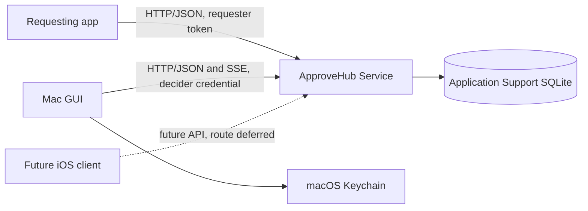
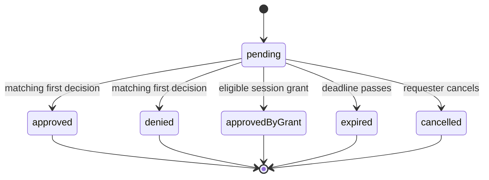

# ApproveHub architecture

Status: Active

ApproveHub is a macOS consent service for cooperative agents. This document records the approved architecture for the Mac-only release. It defines component boundaries and behavior, not endpoint schemas or an implementation timeline. The current SwiftPM targets are skeletons; the service and GUI behavior below is the design to implement.

## Components and boundaries

**ApproveHub Service** is the background API process and owns request lifecycle, authorization, rules, persistence, and event replay. Requesting apps create, wait for, and cancel only their own requests. Deciding clients present state and submit decisions; they contain no approval policy. The Mac GUI and a future iOS client use the same versioned API contract; how an iOS client reaches the service is deferred. Storage adapters, Keychain access, HTTP, SSE, notifications, and biometric prompts remain outside the UI-free domain core.

This division follows the constraints and options in the [server research](research-transport-and-server.md), [hosting research](research-hosting-and-packaging.md), and [security research](research-security-and-exposure.md).

## Hosting model

The service is an app-bundled helper named **ApproveHub Service** on macOS 26 or later. The GUI checks `127.0.0.1:46931` when it launches; if no service is there, it starts its bundled helper in the background. The approved owner-facing command is `approve-hub service`, which starts the same service in the foreground. The current SwiftPM skeleton instead exposes a separate `approve-hub-service` executable; packaging has not yet implemented the owner-facing command. Requesting apps never start the service, it does not start at login, and a crash is not restarted automatically.

The service binds only to `127.0.0.1:46931`. Before sending credentials to an occupied port, a client must establish that the listener is ApproveHub Service; an unknown or unverifiable listener makes startup fail closed. A response from the listener or its acceptance of a client bearer token does not prove its identity. The concrete identity check remains to be designed. This chooses the fixed loopback port from the hosting research; LAN access and socket activation are outside this release.

## Request lifecycle and state machine

The lifecycle actor owns all transitions. A request begins `pending`, uses a two-minute default expiry (at most ten minutes when requested), and ends exactly once. It resolves races between decisions, cancellation, and expiry atomically, so no later operation changes a terminal outcome.

A decision must carry the request identifier and the RFC 8785 canonical-JSON SHA-256 digest of the original, immutable request. The service checks the digest against its stored request, rejects a mismatch, and returns the current state to later decision attempts. The OpenAPI contract must define the exact digested fields and digest encoding when endpoint schemas are designed.

A request is sensitive when its requester flags it or an owner rule matches its requester or exact action-type string. Rules only mark requests sensitive. Approving a sensitive request on the Mac requires Touch ID, including approval from a notification. The Mac client's decision coordinator must complete that check before submitting approval; a decider bearer credential by itself does not attest biometric completion to the service. A session grant can be created only from a non-sensitive request; it applies to later non-sensitive requests with the same requester identity, session ID, and action type, and ends on the requester's explicit session-end call or after one hour. Grant-approved requests enter decided history without notifying the owner. Pending requests and session grants are deliberately dropped at service restart; decided history and owner rules survive.

## API shape

The API is HTTP/JSON below `/v1`; endpoint-level schemas are intentionally deferred. The versioned OpenAPI document is the canonical contract. Once endpoints are designed, Swift OpenAPI Generator will produce shared types plus server and client bindings from that document.

SSE supplies live updates. Event identifiers support bounded in-memory replay through `Last-Event-ID`, subject to the caller's role and request scope. The API must signal when a cursor cannot be replayed. After a service restart or a replay-buffer miss, clients refresh authoritative state and reconnect; the event stream is not the source of truth. Errors use RFC 9457 Problem Details with stable, documented machine-readable error codes; clients must not infer behavior from prose.

## Security model

Requester tokens are distinct, revocable bearer capabilities, scoped to their requester identity. They are stored only as password-quality hashes. The GUI holds a separate decider credential in the macOS Keychain; no requester credential may decide. The service rejects every request carrying an `Origin` header. That check reduces browser-originated and DNS-rebinding exposure, but it is not client or server authentication; role credentials are still required.

Loopback-only HTTP is the transport boundary for this Mac-only release, so TLS and device pairing are not used. The product is consent tooling for cooperative same-user agents, not protection from a hostile same-user process. The service rejects deceptive Unicode and broadly suspected secret-bearing request text before persistence. Accepted request content remains immutable for digest checks and full-text history; display-safe transformations must not silently change what is approved. Unified Logging records only secret-masked, display-safe excerpts up to 1,024 characters.

LAN, remote exposure, iOS pairing, and an iOS deployment floor are explicitly deferred until an iOS client is planned. The API avoids assuming a particular future exposure mechanism.

## Requesting-app connection constraints

Requesters authenticate with their own token and must block their action unless they receive an approval for that request. They must therefore fail closed if the service is unreachable, rejects a request, or the request expires or is cancelled. They may submit and wait in one operation, or create then wait in bounded steps; they can cancel a request they own. A requester that disappears without cancelling may leave a request pending until its deadline. The interaction findings support these patterns without requiring a particular agent adapter; see [agent approval flows](research-agent-approval-flows.md) and [request interaction](research-request-decision-interaction.md).

Hook shims, host-app adapters, and channel relays for Claude Code and Codex CLI remain deferred. The API must preserve plain HTTP/JSON access for future shell-facing adapters and never give a requester a decision capability.

## Module and target layout

| Target | Responsibility |
|---|---|
| `ApproveHubContract` | Versioned OpenAPI-derived types and contract support. |
| `ApproveHubCore` | UI-free domain models, lifecycle actor, rules, and typed errors. |
| `ApproveHubService` | Service executable plus HTTP, persistence, Keychain, and logging adapters. |
| `ApproveHub` | SwiftUI macOS client plus client, notification, and biometric adapters. |

`ApproveHubContract` is the sharing point for the service, Mac GUI, and future iOS client. The current package deliberately declares no endpoints and does not run the generator plugin yet; that happens when endpoint design begins. The executable skeletons contain no server or GUI implementation.

## Concurrency and errors

Swift concurrency isolates mutable lifecycle state in one service actor. Service-side HTTP and persistence adapters mediate access to that actor. The Mac GUI reaches it only through the API; its Keychain, notification, and biometric adapters feed client state rather than calling the service actor directly. SwiftUI views only observe client state and send user intents. Domain and adapter failures use typed errors and are mapped at the HTTP boundary to stable Problem Details codes. No force unwraps or `try!` belong in production code.

## Persistence

Rules and decided-request history live in one SQLite database under Application Support. Migrations run transactionally; a migration error or a newer unknown schema preserves the database and refuses service startup. The database relies on macOS account protection rather than additional encryption. It retains full decided-request text, outcome, and timestamp for 90 days, purging at startup and daily while running; the owner may clear history. Pending requests and session grants remain in memory only.

## Dependencies and licenses

All approved direct dependencies are Apache-2.0 and compatible with this project's Apache-2.0 license. The versions are pinned in `Package.swift`.

| Package | Version | Role |
|---|---:|---|
| Hummingbird | 2.27.0 | HTTP server |
| Swift OpenAPI Generator | 1.14.0 | OpenAPI SwiftPM build plugin |
| Swift OpenAPI Runtime | 1.13.0 | Generated type/runtime support |
| Swift OpenAPI URLSession | 1.3.2 | Generated client transport |
| Swift OpenAPI Hummingbird | 2.1.0 | Generated service transport |

The package selection, platform implications, and license evidence are in [research-transport-and-server.md](research-transport-and-server.md). The approved URLSession transport 1.3.2 accepts Runtime 1.11 or newer, including the approved 1.13.0 runtime.

## Test strategy

Automated coverage is layered: unit tests for lifecycle transitions, expiry, first-decision-wins races, grant exclusions, and digest mismatches; service tests for token scope, port-collision failure before credential disclosure, persistence/migration failures, and retention; and HTTP/SSE tests for Problem Details, role-scoped event delivery, replay, and refresh after replay loss or restart.

A minimal Xcode XCTest/XCUIAutomation host is scaffolded for bundled-app end-to-end coverage. Its placeholder test is skipped until the bundle launcher and injectable biometric and notification adapters exist. Real Touch ID and notification authorization remain documented manual checks. The [local validation gate](contribution-guide.md#required-validation) applies; no CI or scheduled local job was added in P1-M2.
