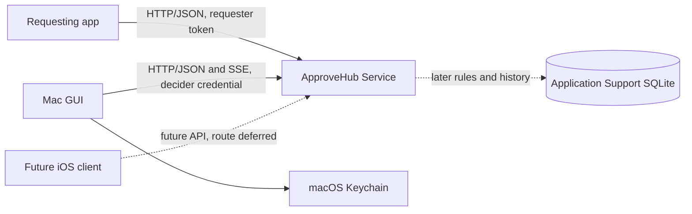
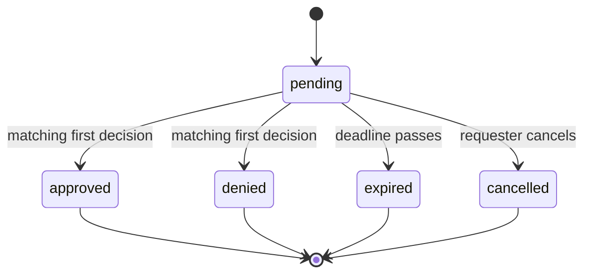

# ApproveHub architecture

Status: Active

ApproveHub is a macOS consent service for cooperative agents. This document records the approved component architecture and distinguishes the [early Phase 1 release](phase-1/phase-1.md) from later approved capabilities. It defines boundaries and behavior, not endpoint schemas. The current SwiftPM targets are skeletons; [P1-M3](phase-1/milestone-03-overview.md) approved the first-run trust path before implementation.

## Components and boundaries

**ApproveHub Service** is the background API process and owns request lifecycle, authorization, and event replay. Rules and decided history are later capabilities. Requesting apps create, wait for, and cancel only their own requests. Deciding clients present state and submit decisions; they contain no approval policy. The Mac GUI and a future iOS client use the same versioned API contract; how an iOS client reaches the service is deferred. Storage adapters, Keychain access, HTTP, SSE, notifications, and biometric prompts remain outside the UI-free domain core.

This division follows the constraints and options in the [server research](research-transport-and-server.md), [hosting research](research-hosting-and-packaging.md), and [security research](research-security-and-exposure.md).

## Hosting model

The service is an app-bundled helper named **ApproveHub Service** on macOS 26 or later. The GUI checks `127.0.0.1:46931` when it launches; if no service is there, it starts its bundled helper in the background. The approved owner-facing command is `approve-hub service`, which starts the same service in the foreground. The current SwiftPM skeleton instead exposes a separate `approve-hub-service` executable; packaging has not yet implemented the owner-facing command. Requesting apps never start the service, it does not start at login, and a crash is not restarted automatically.

The service binds only to `127.0.0.1:46931`. Before every bearer-bearing request, a client must verify a fresh signature from the service against a previously trusted public-key pin. An absent or wrong pin, unknown or unverifiable listener, stale proof, or occupied port fails closed. A response from the listener or its acceptance of a bearer token does not prove identity. This chooses the fixed loopback port from the hosting research; LAN access and socket activation are outside this release.

## Request lifecycle and state machine

The lifecycle actor owns all transitions. A request begins `pending`, uses a two-minute default expiry (at most ten minutes when requested), and ends exactly once. It resolves races between decisions, cancellation, and expiry atomically, so no later operation changes a terminal outcome.

A decision must carry the request identifier and the RFC 8785 canonical-JSON SHA-256 digest of the original, immutable request. The service checks the digest against its stored request, rejects a mismatch, and returns the current state to later decision attempts. The OpenAPI contract must define the exact digested fields and digest encoding when endpoint schemas are designed.

Phase 1 accepts only ordinary requests. It rejects a request flagged sensitive before it becomes pending; it has no rules, session grants, or decided history. Pending requests and their outcomes are deliberately dropped at service restart, and a requester whose wait is interrupted must fail closed.

Later phases retain the approved sensitive-request and session-grant goals in [product behavior](product-behavior.md). The selected direction for proving sensitive approval to the service is a Touch ID-protected signing key producing a request-bound proof that the service verifies. A decider bearer credential alone is insufficient. The exact key lifecycle, signed fields, verification, and recovery belong to the later sensitive-approval design; Phase 1 does not accept sensitive requests. Later rules and decided history use the persistence design below.

## API shape

The API is HTTP/JSON below `/v1`. [P1-M4](phase-1/milestone-04-overview.md) defines endpoint schemas after M3 resolves the trust protocol. The versioned OpenAPI document is the canonical contract. Swift OpenAPI Generator will produce shared types plus server and client bindings from that document.

SSE supplies live updates. Event identifiers support bounded in-memory replay through `Last-Event-ID`, subject to the caller's role and request scope. The API must signal when a cursor cannot be replayed. After a service restart or a replay-buffer miss, clients refresh authoritative state and reconnect; the event stream is not the source of truth. Errors use RFC 9457 Problem Details with stable, documented machine-readable error codes; clients must not infer behavior from prose.

## Security model

Requester tokens are distinct, revocable bearer capabilities, scoped to their requester identity. They are stored only as password-quality hashes. The owner CLI adds, lists, and revokes requesters and exports the service public-key pin; it is not an agent adapter. A new requester token is shown only once. The GUI holds a separate decider credential in the macOS Keychain; no requester credential may decide. The service rejects every request carrying an `Origin` header. That check reduces browser-originated and DNS-rebinding exposure, but it is not client or server authentication; role credentials and the pinned service-key challenge are still required.

### Service identity, pins, and credentials

Before the service accepts traffic, the owner runs explicit local CLI setup. It creates one persistent Ed25519 service signing key in owner-only Application Support storage, stores only a password-quality hash of a separate random GUI decider credential, and writes the GUI copy plus the initial service pin to Keychain. Setup creates no requester credentials. An uninitialized service does not bind the loopback port or accept an unauthenticated setup request; a GUI-launched helper reports that state so the GUI can show Setup Required and its CLI next step.

The pin is a versioned public document containing `ed25519`, the raw 32-byte Ed25519 public key, and its key identifier. Raw public keys, raw 64-byte Ed25519 signatures, and the SHA-256 key identifier use unpadded base64url; the key identifier is the SHA-256 digest of the raw public-key bytes. The owner obtains it as CLI text plus a grouped hexadecimal fingerprint and transfers it independently to each requester. Pins are never learned from a listener, a normal API response, or an automatic key-change prompt.

Key rotation is an owner-initiated hard cutover: the local command creates a new key, replaces the GUI pin, and exports the replacement pin. Existing clients fail closed until the owner installs the replacement. A requester-token replacement revokes the previous token. If the GUI credential is missing or rejected, the GUI first verifies its pinned service proof, then may invoke its bundled local helper to revoke and replace that credential and its Keychain item. No identity failure triggers automatic credential recovery.

For every bearer-bearing request, a client creates a new 32-byte CSPRNG challenge and first obtains a proof. The service RFC 8785-canonicalizes as UTF-8 and signs a payload containing exactly the protocol label `approvehub-service-proof-v1`, fixed listener `http://127.0.0.1:46931`, key identifier, challenge, issued-at time, and expiry no more than 60 seconds after issue. The client accepts the challenge once and only within that 60-second window. Before sending its bearer token, it verifies protocol, listener, installed key identifier, unused challenge, time window, and the Ed25519 signature over the canonical payload. Any malformed encoding, replay, missing or wrong pin, unknown listener, timeout, or port collision prevents credential disclosure. The client discards the challenge after use; it never reuses challenges across retries.

Loopback-only HTTP is the transport boundary for this Mac-only release, so TLS and device pairing are not used. The product is consent tooling for cooperative same-user agents, not protection from a hostile same-user process. The service rejects deceptive Unicode and broadly suspected secret-bearing request text before persistence. Accepted request content remains immutable for digest checks and full-text history; display-safe transformations must not silently change what is approved. Unified Logging records only secret-masked, display-safe excerpts up to 1,024 characters.

LAN, remote exposure, iOS pairing, and an iOS deployment floor are explicitly deferred until an iOS client is planned. The API avoids assuming a particular future exposure mechanism.

## Requesting-app connection constraints

Requesters authenticate with their own token and must block their action unless they receive an approval for that request. They must therefore fail closed if the service is unreachable, rejects a request, or the request expires or is cancelled. They may submit and wait in one operation, or create then wait in bounded steps; they can cancel a request they own. A requester that disappears without cancelling may leave a request pending until its deadline. The interaction findings support these patterns without requiring a particular agent adapter; see [agent approval flows](research-agent-approval-flows.md) and [request interaction](research-request-decision-interaction.md).

Hook shims, host-app adapters, and channel relays for Claude Code and Codex CLI remain deferred. The API must preserve plain HTTP/JSON access for future shell-facing adapters and never give a requester a decision capability.

## Module and target layout

| Target | Responsibility |
|---|---|
| `ApproveHubContract` | Versioned OpenAPI-derived types and contract support. |
| `ApproveHubCore` | UI-free domain models, lifecycle actor, and typed errors; later rules. |
| `ApproveHubService` | Service executable plus HTTP, credential persistence, Keychain, and logging adapters; later rules and history storage. |
| `ApproveHub` | SwiftUI macOS client plus API client and Keychain adapters; later notification and biometric adapters. |

`ApproveHubContract` is the sharing point for the service, Mac GUI, and future iOS client. The current package deliberately declares no endpoints and does not run the generator plugin yet; that happens when endpoint design begins. The executable skeletons contain no server or GUI implementation.

## Concurrency and errors

Swift concurrency isolates mutable lifecycle state in one service actor. Service-side HTTP adapters mediate access to that actor. The Mac GUI reaches it only through the API; its Keychain adapter feeds client state rather than calling the service actor directly. Later notification and biometric adapters follow the same boundary. SwiftUI views only observe client state and send user intents. Domain and adapter failures use typed errors and are mapped at the HTTP boundary to stable Problem Details codes. No force unwraps or `try!` belong in production code.

## Persistence

Phase 1 persists the service signing key and credentials according to M3's approved bootstrap. Requests and outcomes remain in memory only and disappear on restart.

When rules and decided-request history are implemented later, they live in one SQLite database under Application Support. Migrations run transactionally; a migration error or a newer unknown schema preserves the database and refuses service startup. The database relies on macOS account protection rather than additional encryption. It retains full decided-request text, outcome, and timestamp for 90 days, purging at startup and daily while running; the owner may clear history. Session grants remain in memory only.

## Dependencies and licenses

All approved direct dependencies are Apache-2.0 and compatible with this project's Apache-2.0 license. The versions are pinned in `Package.swift`.

| Package | Version | Role |
|---|---:|---|
| Hummingbird | 2.27.0 | HTTP server |
| Swift OpenAPI Generator | 1.14.0 | OpenAPI SwiftPM build plugin |
| Swift OpenAPI Runtime | 1.13.0 | Generated type/runtime support |
| Swift OpenAPI URLSession | 1.3.2 | Generated client transport |
| Swift OpenAPI Hummingbird | 2.1.0 | Generated service transport |

The package selection, platform implications, and license evidence are in [research-transport-and-server.md](research-transport-and-server.md). The approved URLSession transport 1.3.2 accepts Runtime 1.11 or newer, including the approved 1.13.0 runtime.

## Test strategy

Phase 1 coverage is layered: unit tests for lifecycle transitions, expiry, first-decision-wins races, sensitive rejection, and digest mismatches; service tests for token scope, identity verification before credential disclosure, credential persistence, and port-collision failure; and HTTP/SSE tests for Problem Details, role-scoped event delivery, replay, and refresh after replay loss or restart. Grant exclusion, rules, history migration, and retention tests belong with their later features.

A minimal Xcode XCTest/XCUIAutomation host is scaffolded for bundled-app end-to-end coverage. Its placeholder is replaced with a running requester-to-GUI-to-requester test by P1-M10; Phase 1 does not depend on biometric or notification adapters. Real Touch ID and notification authorization are later manual checks. The [local validation gate](contribution-guide.md#required-validation) applies; no CI or scheduled local job was added in P1-M2.
